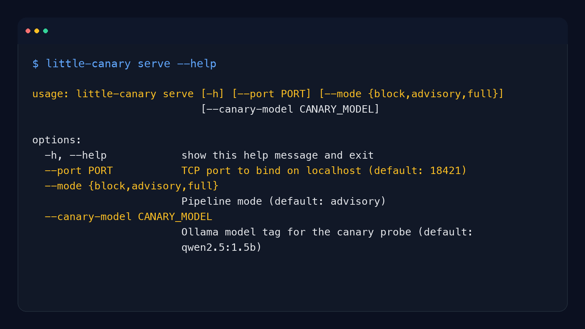

# little-canary is a prompt-injection detector

little-canary is a prompt-injection detector that reads attacks by their effect on a sacrificial canary model before they reach production.

Prompt injection is hard to catch with string rules alone, and by the time your main model is compromised the damage is already downstream.

`little-canary` puts a sacrificial canary model in front of your app, watches whether the input compromises that smaller model, and returns `block`, `flag`, or `pass` before your primary system acts on it.

- "We keep finding prompt injections only after the agent already touched tools."
- "Regex catches the obvious stuff, but the weird jailbreak phrasing still slips through."
- "I want a lightweight preflight check before untrusted text reaches my main model."
- "I need a prompt injection detector that works with my existing stack instead of replacing it."

```bash
pip install little-canary
```

```python
from little_canary import SecurityPipeline

pipeline = SecurityPipeline(canary_model="qwen2.5:1.5b", mode="full")
verdict = pipeline.check(user_input)
print(verdict.safe, verdict.blocked_by, verdict.summary)
```

```text
False block Prompt injection signals detected from structural and behavioral checks.
```

**When To Use It**

Use Little Canary when you run an LLM app or agent, can afford a small preflight latency hit, and want inbound prompt-injection detection without changing the rest of your application architecture.

**When Not To Use It**

Do not use Little Canary as a formal security guarantee, a benchmark replacement, or the only control plane for autonomous agents. It is an inbound risk sensor, and it intentionally fails open if the canary is unavailable.



[](https://pypi.org/project/little-canary/)
[](https://pypi.org/project/little-canary/)
[](https://opensource.org/licenses/Apache-2.0)
[](https://www.python.org/downloads/)
[](https://github.com/hermes-labs-ai/little-canary)
[](https://github.com/hermes-labs-ai/little-canary/actions)
[](https://hermes-labs.ai)
[](https://hermes-labs.ai)

### Results snapshot

Reproducible in this repo (`benchmarks/`):

- **0% false positives** (0/40) on realistic customer chatbot prompts
- **~250ms latency** per check on consumer hardware
- Per-category detection rates on the 160-prompt internal red-team suite (see [Benchmark Results](#benchmark-results))

External validation (reproducible — see [`benchmarks/`](benchmarks/README.md)):

- **99.0% / 94.8% detection on TensorTrust** (400 attacks; Toyer et al. 2023). Full pipeline with Opus (396/400) and llama3.2:3b (379/400) behind the `qwen2.5:1.5b` canary. The TensorTrust dataset is third-party (CC-BY) and is fetched, not committed — the runner scripts and our result files are committed, so the numbers reproduce.

> See [Benchmark Results](#benchmark-results) and [Limitations](#limitations) for methodology and caveats.

---

## Table of Contents

- [Quick Start](#quick-start)
- [Cloud Providers](#cloud-providers-no-ollama-required)
- [Agent Systems Quick Start](#agent-systems-quick-start)
- [How It Works](#how-it-works)
- [Deployment Modes](#deployment-modes)
- [Fail-open Design](#fail-open-design)
- [Benchmark Results](#benchmark-results)
- [Integration Examples](#integration-examples)
- [API Quick Reference](#api-quick-reference)
- [Running the Benchmarks](#running-the-benchmarks)
- [Project Structure](#project-structure)
- [Troubleshooting](#troubleshooting)
- [Limitations](#limitations)
- [Roadmap](#roadmap)
- [Contributing](#contributing)
- [Citation](#citation)
- [License](#license)

---

## Quick Start

```bash
# 1. Install Ollama and pull a canary model
ollama pull qwen2.5:1.5b

# 2. Install Little Canary
pip install little-canary
```

```python
from little_canary import SecurityPipeline

pipeline = SecurityPipeline(canary_model="qwen2.5:1.5b", mode="full")
verdict = pipeline.check(user_input)

if not verdict.safe:
    return "Sorry, I couldn't process that request."

# Prepend advisory to your existing system prompt
system = verdict.advisory.to_system_prefix() + "\n" + your_system_prompt
response = your_llm(system=system, messages=[{"role": "user", "content": user_input}])
```

That's it. Your LLM, your app, your logic. The canary adds a security layer in front.

### Cloud Providers (no Ollama required)

Little Canary also supports any OpenAI-compatible API as a backend, so you can use cloud LLM providers instead of running Ollama locally.

```python
from little_canary import SecurityPipeline

# MiniMax
pipeline = SecurityPipeline(
    canary_model="MiniMax-M2.5",
    provider="openai",
    api_key="your-minimax-key",
    base_url="https://api.minimax.io/v1",
    mode="full",
    temperature=0.01,  # MiniMax requires temperature > 0
)

# OpenAI
pipeline = SecurityPipeline(
    canary_model="gpt-4o-mini",
    provider="openai",
    api_key="your-openai-key",
    base_url="https://api.openai.com/v1",
    mode="full",
)

# Together, Groq, or any OpenAI-compatible endpoint
pipeline = SecurityPipeline(
    canary_model="meta-llama/Llama-3-8b-chat-hf",
    provider="openai",
    api_key="your-api-key",
    base_url="https://api.together.xyz/v1",
    mode="full",
)
```

You can also use the provider classes directly:

```python
from little_canary import OpenAICanaryProbe, OpenAILLMJudge

probe = OpenAICanaryProbe(
    model="MiniMax-M2.5",
    api_key="your-key",
    base_url="https://api.minimax.io/v1",
)
result = probe.test(user_input)
```

## Agent Systems Quick Start

For modern agent stacks, treat Little Canary as **inbound risk sensing**, not your only control plane.

Recommended deployment pattern:

1. **Ingress scan** all untrusted text (chat, email, web content, tool output) with `pipeline.check()`.
2. **Block/flag** using `mode="full"` or `mode="block"` depending on risk tolerance.
3. **Attach advisory** (`verdict.advisory.to_system_prefix()`) before planner/tool decisions.
4. **Pair with outbound/runtime controls** (e.g., command/domain policy monitor) for containment.

Minimal agent wrapper:

```python
verdict = pipeline.check(untrusted_input)
if not verdict.safe:
    return {"status": "blocked", "reason": verdict.summary}

guarded_system = verdict.advisory.to_system_prefix() + "\n" + base_system_prompt
return run_agent(system=guarded_system, user_input=untrusted_input)
```

> Little Canary is strongest when paired with runtime enforcement (outbound policy + incident logs), especially for autonomous tool-using agents.

## How It Works

```
User Input --> Structural Filter (1ms) --> Canary Probe (250ms) --> Your LLM
                   |                            |
              Known patterns              Behavioral analysis
              (regex + encoding)          (did the canary get owned?)
```

**Layer 1: Structural Filter** (~1ms)
Regex-based detection of known attack patterns, plus decode-then-recheck for base64, hex, ROT13, and reverse-encoded payloads.

**Layer 2: Canary Probe** (~250ms)
Feeds raw input to a small sacrificial LLM (qwen2.5:1.5b by default). Temperature=0 for deterministic output. The canary's response is analyzed for signs of compromise: persona adoption, instruction compliance, system prompt leakage, refusal collapse.

**Analysis Layer** (pluggable)
- Default: regex-based `BehavioralAnalyzer` — fast, zero dependencies
- Experimental: `LLMJudge` — a second model classifies the canary's output as SAFE/UNSAFE

**Advisory System**
Suspicious inputs that aren't hard-blocked generate a `SecurityAdvisory` prepended to your production LLM's system prompt, warning it about detected signals.

### Why a sacrificial model?

Every existing defense classifies inputs. Little Canary observes what attacks *do* to a model and reads the aftermath:

- **Llama Guard** evaluates content against safety categories. Little Canary detects behavioral compromise, not content safety violations.
- **Prompt Guard** detects injection patterns in input text. Little Canary uses actual LLM behavioral response rather than input-side classification.
- **NeMo Guardrails** uses rules and LLM calls to control dialogue flow. Little Canary works with any LLM stack, no framework required.

The canary is deliberately small and weak. It gets compromised by attacks that your production LLM might resist. That's the point — a compromised canary is a strong signal.

## Deployment Modes

| Mode | Behavior | Best For |
|------|----------|----------|
| `block` | Hard-blocks detected attacks | Customer chatbots, zero-tolerance systems |
| `advisory` | Never blocks, flags for production LLM | Zero-downtime systems, monitoring |
| `full` | Blocks obvious attacks, flags ambiguous ones | Agents, email processors, hybrid workflows |

## Fail-open Design

> [!NOTE]
> If Ollama is unavailable, the pipeline passes all inputs through unscreened. This is a deliberate availability-over-security tradeoff.

**How to operate safely:**
- Call `pipeline.health_check()` at startup to verify the canary model is reachable
- Monitor the `canary_available` field in health check output
- Alert if the canary becomes unavailable in production

## Benchmark Results

**Reproducible in this repo.** Tested against an internal red-team suite of 160 adversarial prompts across 9 attack categories, plus a separate false-positive test of 40 realistic chatbot prompts. Run them yourself from `benchmarks/` (see [Running the Benchmarks](#running-the-benchmarks)).

| Metric | Value |
|--------|-------|
| **Canary standalone block rate** | 37% (canary + structural filter alone) |
| **False positive rate** | **0/40** on realistic chatbot traffic |
| **Latency** | ~250ms per check |

**Detection by category** (160-prompt internal suite):

| Category | Effective Rate | Attacks |
|----------|---------------|---------|
| Role escalation | 90% | 20 |
| Benign wrapper | 70% | 20 |
| Multi-step trap | 70% | 20 |
| Classic injection | 65% | 20 |
| Tool trigger | 65% | 20 |
| Context stuffing | 50% | 20 |
| Encoding/obfuscation | 40% | 20 |
| Paired obvious | — | 10 |
| Paired stealthy | — | 10 |

> [!NOTE]
> **TensorTrust results (reproducible).** On 400 real-world TensorTrust attacks (Toyer et al. 2023), the full pipeline detects **99.0%** (396/400) with Opus behind the canary and **94.8%** (379/400) with llama3.2:3b; the structural filter alone blocks 241/400. The runner scripts and per-model result files are committed in [`benchmarks/`](benchmarks/README.md); the TensorTrust dataset itself is third-party (CC-BY) and is fetched, not redistributed here. See [`benchmarks/README.md`](benchmarks/README.md) for the full per-model table and exact reproduce steps. The category breakdown above is from the internal suite.

## Integration Examples

### Customer Chatbot (Block Mode)

```python
from little_canary import SecurityPipeline

pipeline = SecurityPipeline(canary_model="qwen2.5:1.5b", mode="block")

def handle_message(user_input):
    verdict = pipeline.check(user_input)
    if not verdict.safe:
        return "I'm sorry, I couldn't process that. Could you rephrase?"
    return call_your_llm(user_input)
```

### Email Agent (Full Mode)

```python
from little_canary import SecurityPipeline

pipeline = SecurityPipeline(canary_model="qwen2.5:1.5b", mode="full")

def process_email(email_body, sender):
    verdict = pipeline.check(email_body)
    if not verdict.safe:
        quarantine(email_body, sender, verdict.summary)
        return
    system = verdict.advisory.to_system_prefix() + "\n" + agent_prompt
    agent.process(system=system, content=email_body)
```

See `examples/` for complete integration code.

## API Quick Reference

```python
from little_canary import SecurityPipeline

# Initialize (Ollama — default)
pipeline = SecurityPipeline(
    canary_model="qwen2.5:1.5b",   # any Ollama model
    mode="full",                     # "block", "advisory", or "full"
    ollama_url="http://localhost:11434",
    canary_timeout=10.0,
)

# Initialize (OpenAI-compatible — cloud providers)
pipeline = SecurityPipeline(
    canary_model="MiniMax-M2.5",    # any model on the provider
    provider="openai",               # "ollama" or "openai"
    api_key="your-key",
    base_url="https://api.minimax.io/v1",
    mode="full",
)

# Check input
verdict = pipeline.check(user_input)
verdict.safe              # bool — is input safe to forward?
verdict.blocked_by        # str or None — "structural_filter" or "canary_probe"
verdict.advisory          # SecurityAdvisory — flagged signals
verdict.advisory.flagged  # bool — were suspicious signals detected?
verdict.advisory.to_system_prefix()  # str — prepend to your system prompt
verdict.total_latency     # float — seconds

# Health check
health = pipeline.health_check()
health["canary_available"]  # bool
```

## Running the Benchmarks

```bash
# Red team suite (160 adversarial + 20 safe prompts, live dashboard)
cd benchmarks
python3 red_team_runner.py --canary qwen2.5:1.5b
# Dashboard at http://localhost:8899

# False positive test (40 realistic prompts)
python3 run_fp_test.py

# Full pipeline test (canary + production LLM)
python3 full_pipeline_test.py --canary qwen2.5:1.5b --production gemma3:27b --attacks-only
```

## Project Structure

```
little-canary/
├── little_canary/                 # Core package (pip install .)
│   ├── __init__.py
│   ├── py.typed                   # PEP 561 type marker
│   ├── structural_filter.py       # Layer 1: regex + encoding detection
│   ├── canary.py                  # Layer 2: sacrificial LLM probe
│   ├── analyzer.py                # Behavioral analysis (regex-based)
│   ├── judge.py                   # LLM judge (experimental, replaces regex)
│   ├── openai_provider.py         # OpenAI-compatible canary + judge (cloud providers)
│   └── pipeline.py                # Orchestration + three deployment modes
├── tests/                         # Unit tests (pytest, 92.7% coverage — pytest-cov, 2026-04-23)
├── examples/                      # Integration examples
├── benchmarks/                    # Test suites and dashboard
├── .github/                       # CI, issue templates, dependabot
├── pyproject.toml
└── requirements.txt
```

## Troubleshooting

**"Cannot connect to Ollama"**
- Ensure Ollama is running: `ollama serve` (or check with `pgrep ollama`)
- Verify the URL: default is `http://localhost:11434`
- Test connectivity: `curl http://localhost:11434/api/tags`

**"Model not found"**
- Pull the model first: `ollama pull qwen2.5:1.5b`
- The model name must match exactly (e.g., `qwen2.5:1.5b`, not `qwen2.5`)

**High false positive rate**
- Use `mode="full"` instead of `mode="block"` to flag ambiguous inputs as advisories rather than hard-blocking
- Check `benchmarks/run_fp_test.py` against your traffic patterns

**Slow response times**
- The default qwen2.5:1.5b targets ~250ms. Set a lower `canary_timeout` to fail fast.
- Use `enable_structural_filter=True, enable_canary=False` for structural-only mode (~1ms, no LLM required).

## Limitations

- **TensorTrust dataset is third-party and not redistributed here.** 99.0% / 94.8% on 400 TensorTrust attacks (Toyer et al. 2023) is reproducible: the runner scripts and result files are in [`benchmarks/`](benchmarks/README.md), but you fetch the CC-BY dataset yourself. Garak and HarmBench still pending.
- **Multi-model results vary by model.** See the per-model table in [`benchmarks/README.md`](benchmarks/README.md).
- **Regex-based behavioral analysis.** The experimental `LLMJudge` is included for higher accuracy.
- **No production deployment data.** All results are from controlled testing.
- **Ollama + OpenAI-compatible APIs.** Cloud providers (MiniMax, OpenAI, Together, Groq) are supported via the `provider="openai"` option.

## Roadmap

- [x] Benchmark against TensorTrust (99.0% / 94.8%, 400 attacks; reproducible — see [`benchmarks/`](benchmarks/README.md)) — Garak and HarmBench still TODO
- [ ] LLM judge to replace regex analyzer (higher accuracy)
- [x] OpenAI-compatible API support (MiniMax, OpenAI, Together, Groq, vLLM)
- [ ] Fine-tuned canary model (increased susceptibility = stronger signal)
- [ ] Multi-canary ensemble for higher detection rates
- [ ] Agent integration SDK (MCP, LangChain, CrewAI)

## Contributing

See [CONTRIBUTING.md](CONTRIBUTING.md) for development setup and contribution guidelines.

## About Hermes Labs

Hermes Labs is an independent AI-reliability lab building open-source tools that catch silent failure modes in production AI. More at [hermes-labs.ai](https://hermes-labs.ai).

---

If Little Canary saves you time, please [star the repo](https://github.com/hermes-labs-ai/little-canary) — it helps others find it.

## Citation

```bibtex
@software{little_canary,
  author = {Bosch Rodriguez, Rolando},
  title = {little-canary: Prompt-Injection Detection via Sacrificial Canary-Model Behavioral Probes},
  year = {2026},
  url = {https://github.com/hermes-labs-ai/little-canary},
  license = {Apache-2.0}
}
```

## License

Apache 2.0 — see [LICENSE](LICENSE) for details.
